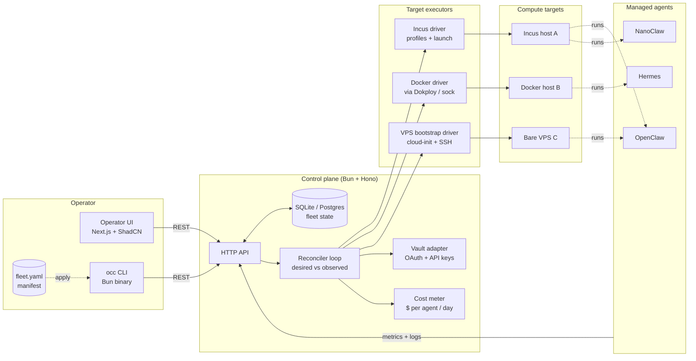

# 02 — Architecture

OpenClaw Deploy is a **declarative control plane** with a control loop, a multi-target executor, an observation pipeline, and a small operator UI.

## System diagram



## Components

### 1. Manifest (`fleet.yaml`)
The single source of truth for desired state. A 14-line YAML can declare agent counts, target placement, profile bindings, and OAuth references.

```yaml
# fleet.yaml — illustrative
apiVersion: openclaw.deploy/v1
fleet: prin7r-prod
agents:
  - name: nanoclaw-pool
    type: NanoClaw
    image: ghcr.io/openclaw/nanoclaw:1.4.2
    target: incus://dev2
    replicas: 5
    auth:
      claude_oauth: ref(vault://oauth/claude_main)
  - name: hermes-bridge
    type: Hermes
    image: ghcr.io/openclaw/hermes:0.9.1
    target: docker://144
    replicas: 2
```

### 2. Operator UI (`apps/landing/` for marketing; `apps/app/` later for dashboard)
Two surfaces:
- **Marketing landing** (Wave 2 deliverable): Next.js 15 + ShadCN, branded per `01-brand-identity.md`.
- **Operator dashboard** (post-Wave 2): real-time fleet view with status pulse dots, cost columns, drift indicator, manifest diff viewer.

### 3. Control plane API (`apps/api/`)
- Bun + Hono on `:8787`.
- REST surface: `POST /v1/fleets/apply`, `GET /v1/fleets/:id/state`, `POST /v1/agents/:id/drain`, `POST /v1/agents/:id/rotate-keys`.
- Auth: API token (Bearer) + per-fleet RBAC.
- Status (Wave 2 batch 1): scaffolded with a single `GET /healthz` returning `{"status":"ok","service":"openclaw-deploy-api"}`. Full implementation deferred.

### 4. Reconciler loop
- Tick: 5s (configurable).
- Reads desired state from manifest store, observed state from each executor, computes diff, applies smallest possible action set.
- Idempotent. Safe to interrupt mid-cycle.
- Exposes `/v1/reconcile/last` for dashboard timeline.

### 5. Executors (drivers)
- **Incus driver**: `incus launch` with profile binding, `incus exec` for hot config, `incus stop --force` for drain.
- **Docker driver**: connects to Dokploy or a remote Docker socket; uses Docker labels to track ownership.
- **VPS bootstrap driver**: provisions a fresh VPS via cloud-init, installs Incus or Docker, then hands off to the matching driver.

### 6. Secrets
- **Vault adapter** (Hashicorp Vault, OpenBao, or local-file fallback for solo operators).
- Tokens are *referenced*, never copied into manifests.
- OAuth refresh hooks: a `rotate-keys` op iterates agents in dependency order, ensuring zero overlap of stale tokens.

### 7. Cost meter
- Pulls per-agent LLM call counts from agent runtime.
- Multiplies by current model price table (configurable).
- Surfaces `$/day/agent`, `$/day/fleet`, `$/1k-tasks` rolling.

## Data flow — applying a manifest

1. Operator runs `occ apply -f fleet.yaml`.
2. CLI POSTs the manifest to the control plane API.
3. API validates the manifest schema; rejects on syntax or referential errors.
4. API writes the desired state into the state store and emits an `apply` event.
5. Reconciler picks up the event, fans out to executors per target.
6. Each executor reports `created / unchanged / failed` per agent.
7. Reconciler writes the observed state and computes diff drift; UI subscribes via SSE.

## Deploy topology (this Wave 2 build)

```
github.com/prin7r-projects/openclaw-deploy
  ├─ apps/landing         (this wave: Next.js 15 marketing site)
  ├─ apps/api             (this wave: Hono "hello" endpoint stub)
  └─ apps/app             (later wave: full operator dashboard)

storage-contabo (161.97.99.120)
  ├─ docker compose up -d
  └─ Traefik (host network)
       └─ openclaw-deploy.prin7r.com → landing:3000 (LE TLS)
```

## Failure modes & recovery

| Failure | Detection | Recovery |
|---|---|---|
| OAuth token expires | agent emits 401 | reconciler triggers `rotate-keys` chain |
| Incus host network blip | reconciler `incus list` fails | exponential backoff, mark fleet drift |
| Docker daemon dies | health check fails | drain agents on that host, redirect replicas |
| Manifest typo | schema validation | reject at API layer, no state change |
| Reconciler crash | systemd / k8s restart | resume from last checkpoint in state store |

## Non-goals (v1)

- Multi-region active-active (v2).
- Custom WASM runtimes (v2).
- A general-purpose container orchestrator (use Kubernetes for that).
- A chat UI for editing manifests in natural language (out of scope; manifests stay declarative).

## Security posture

- All API traffic over HTTPS via Traefik + Let's Encrypt.
- Secrets never logged.
- Audit log of every reconciler action, exportable to S3-compatible storage.
- Optional read-only API tokens for dashboards.
