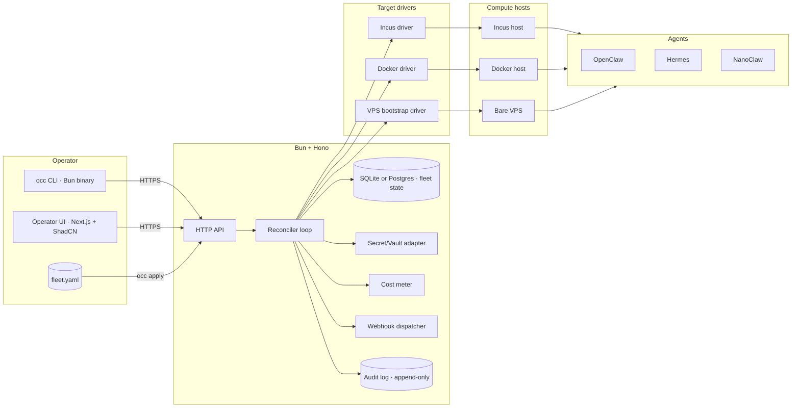
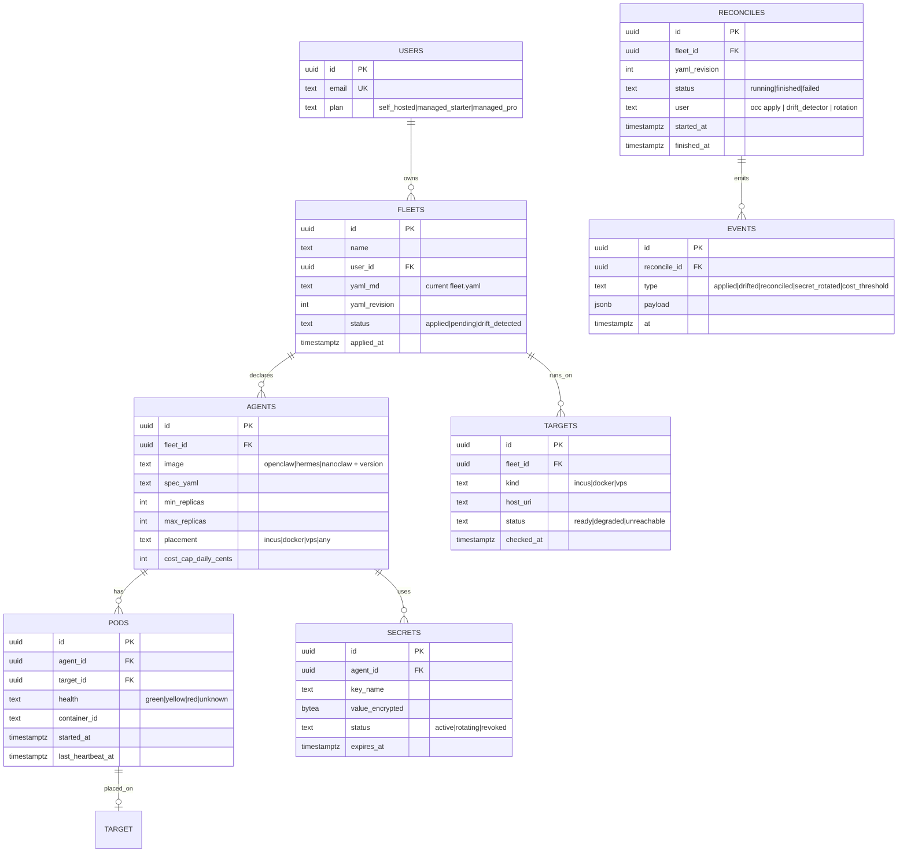

# 12 · Technical specification

> Cold Iron / OpenClaw Deploy = control-plane API + reconciler loop + multi-target executors + small
> operator UI. Wave 2 ships landing + crypto checkout + minimal `occ` install. Wave 3 ships the
> reconciler + executors + UI.

## 1. Architecture overview

**Topology.** Single control-plane VPS by default (storage-contabo for Prin7r-internal; customer
self-hosts for licensed deploys). Targets are the customer's compute fleet. SQLite for solo;
Postgres for >5 targets.

## 2. Data model

Indexes: `fleets.user_id`, `pods.agent_id`, `secrets.expires_at`, `events.at`.

## 3. API contracts

### Public

| Method | Path | Auth | Request | Response |
|---|---|---|---|---|
| POST | `/api/v1/fleets/:id/apply` | Bearer | `{yaml_md}` | `{reconcile_id, plan_diff}` |
| GET | `/api/v1/fleets/:id` | Bearer | — | `{fleet, agents, pods, targets}` |
| POST | `/api/v1/fleets/:id/rotate` | Bearer | `{agent_id?, secret_key_name}` | `{reconcile_id}` |
| GET | `/api/v1/reconciles/:id` | Bearer | — | `{status, events[]}` |
| POST | `/api/v1/webhooks` | Bearer | `{url, events[], secret}` | `{webhook_id}` |
| POST | `/api/checkout/nowpayments` | none | `{plan}` | `{invoice_url}` |
| POST | `/api/webhooks/nowpayments` | HMAC-SHA512 | NOWPayments IPN | `{ok:true}` |

### Outbound webhooks (to customer)

Header: `x-coldiron-sig: t=<unix>,v1=<HMAC-SHA256>`. Events: `fleet.applied`, `fleet.drifted`,
`fleet.reconciled`, `secret.rotated`, `cost.threshold_breached`, `target.degraded`, `pod.unhealthy`.

## 4. Integrations

| Integration | Auth | Rate | Fallback |
|---|---|---|---|
| Incus REST API | TLS client cert | 100 RPS | Mark target degraded |
| Docker socket / Dokploy API | Unix socket / Bearer | 100 RPS | Mark target degraded |
| SSH (VPS bootstrap) | SSH key | 10 concurrent | Retry; mark target unreachable after 3 |
| OAuth providers (Anthropic, OpenAI, Z.AI, etc.) | OAuth2 refresh token | varies | Manual rotation flow |
| NOWPayments | x-api-key + IPN HMAC | 100 RPM | Manual invoice |
| Cost telemetry source (LLM provider billing API or per-pod meter) | API key / scrape | varies | Mark cost stale=true |

## 5. Storage

- **SQLite** for solo / single-fleet customers (default install).
- **Postgres** when `fleets.targets > 5` or `agents.pods > 50`. Cold Iron CLI has an `occ migrate
  postgres` command.
- Audit log is append-only Postgres table or SQLite WAL-friendly table; daily B2 export with
  hash-chain.
- Secret material encrypted with libsodium per-secret using a master key from `COLD_IRON_KEY_PASSPHRASE`.
- Retention: events forever (audit). Pods/secrets rows: revoked secrets retained 90d.

## 6. Auth

- **Operator UI / occ CLI:** Cold Iron account auth (magic link Wave 3); machine tokens for CI.
- **Outbound webhooks:** customer-provided HMAC secret.
- **Targets:** TLS client cert (Incus), socket/cert (Docker), SSH keys (VPS).

## 7. Security

- Secrets in libsodium-encrypted column; never in logs.
- Rate limits: `apply` 30/hr/fleet; `rotate` 100/hr/fleet; webhooks unlimited.
- Idempotency: every `apply` keyed on `yaml_revision`; second submission no-ops.
- Audit log: every apply, every rotate, every override-cost-cap.
- Reconciler is read-only on observed state until apply commits.

## 8. Observability

- Pino JSON logs → Loki.
- Metrics: `coldiron.reconcile.duration_s`, `coldiron.pods.unhealthy`, `coldiron.secret.rotation_lead_h`,
  `coldiron.cost.daily_cents`, `coldiron.target.unreachable_count`.
- Traces: OTel; reconcile spans across executors.
- Alerts: `coldiron.target.unreachable_count > 0 for 5m`; `coldiron.secret.rotation_lead_h < 6 for 1h`;
  `coldiron.cost.daily_cents > cost_cap`.

## 9. Performance budgets

| Path | p50 | p95 |
|---|---|---|
| `occ plan` (12-agent fleet) | 800ms | 2s |
| `occ apply` reconcile (12 agents, no drift) | 4s | 10s |
| Reconcile with 12 new pods | 60s | 240s |
| Drift detection cycle | 10s | 30s |
| Secret rotation per agent | 2s | 6s |
| Webhook delivery | 200ms | 1s |

Throughput: 100 fleets per control-plane VPS; 5 concurrent applies.

## 10. Non-goals

- No managed Kubernetes path.
- No arbitrary customer code execution; agents are vetted images.
- No proprietary lock-in (substrate is exposed).
- No silent failover across targets.
- No "smart" cost throttling beyond declared caps.
- No on-the-fly agent image building (customers bring their own image tags).
- No GUI-only fleet authoring (yaml is the source of truth; UI is read-mostly).
